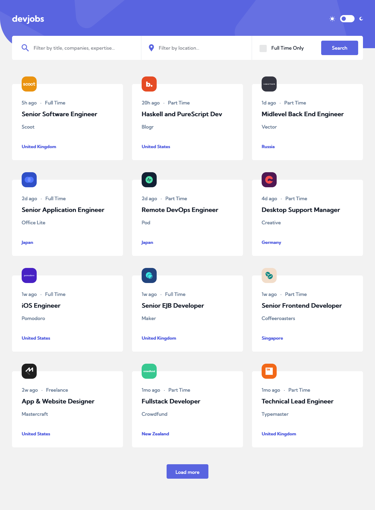
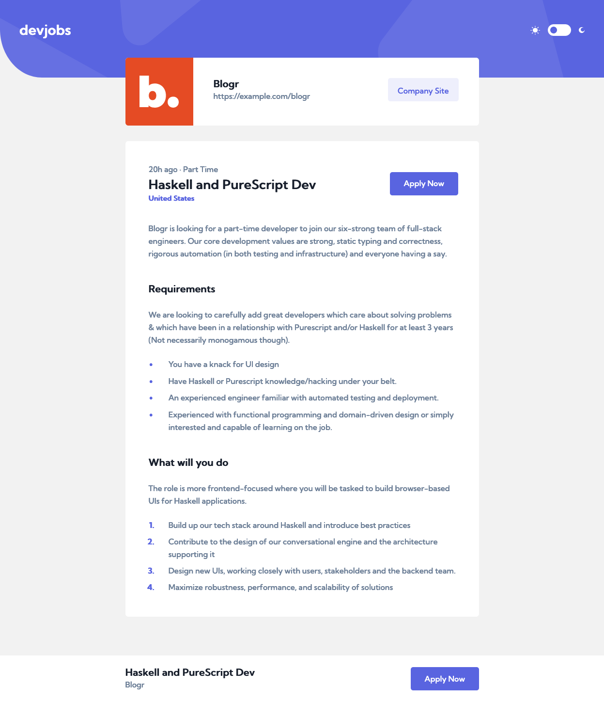
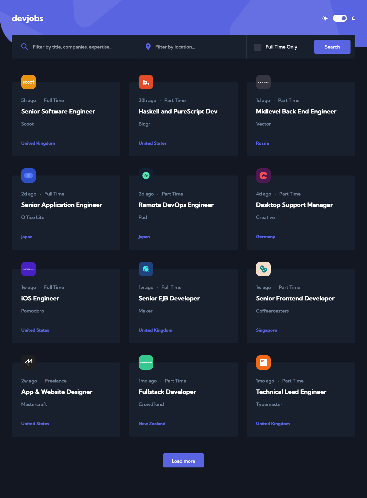
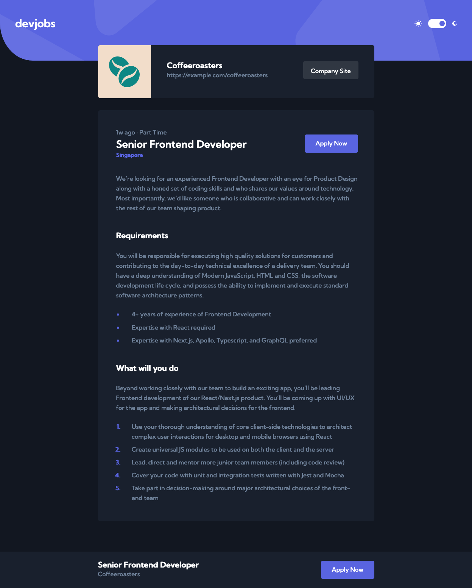
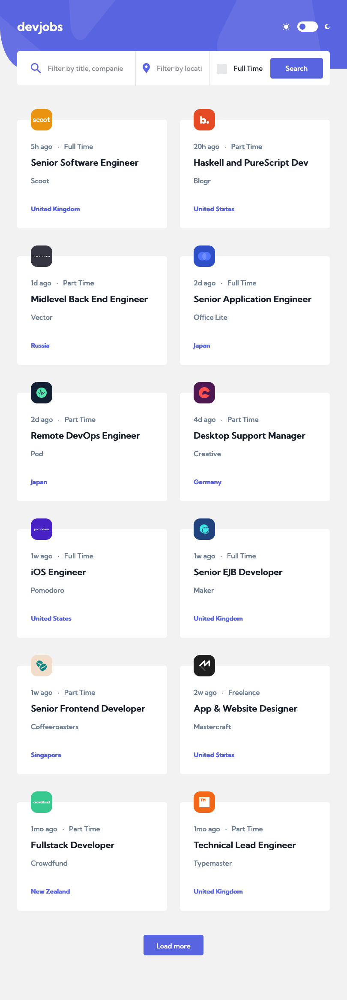
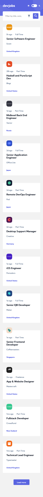
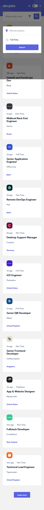
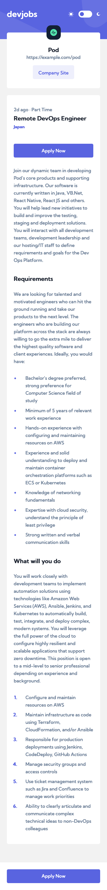

## Table of contents

- [Overview](#overview)
  - [The challenge](#the-challenge)
  - [Screenshot](#screenshot)
  - [Links](#links)
- [My process](#my-process)
  - [Built with](#built-with)
  - [What I learned](#what-i-learned)
  - [Continued development](#continued-development)
  - [Useful resources](#useful-resources)

## Overview

### The challenge

Users should be able to:

- View the optimal layout for each page depending on their device's screen size
- See hover states for all interactive elements throughout the site
- Be able to filter jobs on the index page by title, location, and whether a job is for a full-time position
- Be able to click a job from the index page so that they can read more information and apply for the job

### Screenshot

#### Desktop

#### Tablet

#### Mobile

### Links

- [Solution URL](https://your-solution-url.com)
- [Live Site URL](vinhyan.github.io/devjobs/)

## My process

### Built with

- Semantic HTML5 markup
- CSS custom properties
- Flexbox
- CSS Grid
- [React](https://reactjs.org/) - JS library
- [Redux](https://redux.js.org/) - JS library for state management
- [Styled Components](https://styled-components.com/) - For styles

### What I learned

- Pagination `Learn More` button to load more content
- Using `ThemeProvider` to switch between dark/light theme

### Continued development

- State management with Redux

### Useful resources

- [Load More Pagination](https://www.youtube.com/watch?v=Ka3OQpwqxXA&t=378s) - This helped me for `Load More` button
